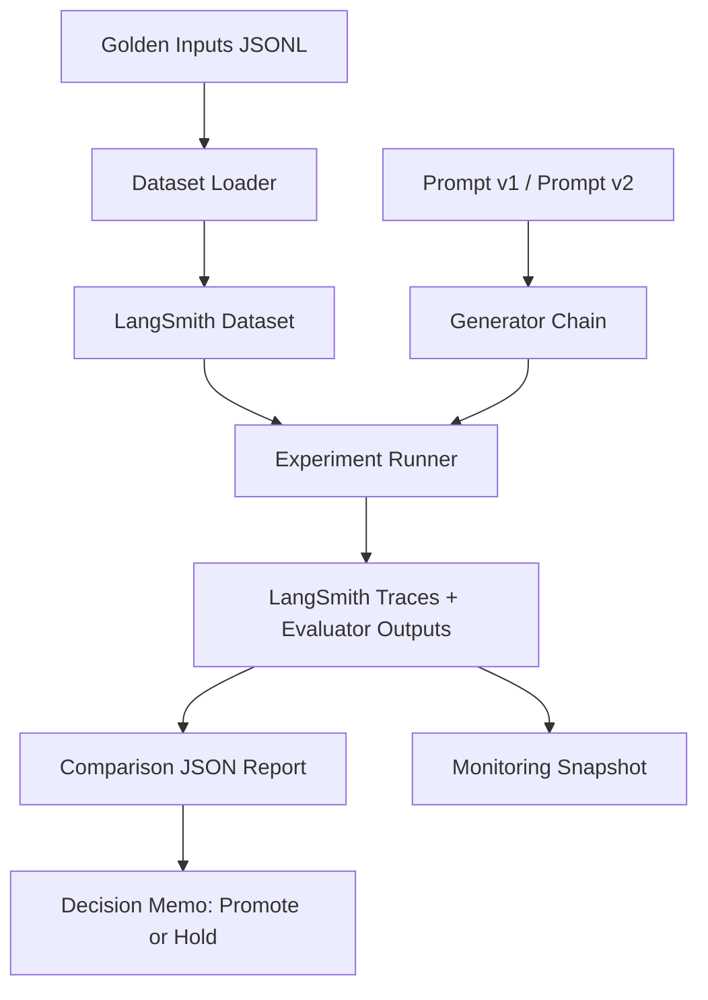

# Architecture and Flow

## Why this architecture
This design separates content generation from evaluation governance.

- Dataset gives repeatability.
- Prompt versions give controlled change management.
- Trace data gives observability.
- Comparison report gives objective decision support.

## Components and responsibilities
- `data/golden_inputs.jsonl`
  Source scenarios used as evaluation inputs.

- `scripts/create_dataset.py`
  Registers or reuses a LangSmith dataset from golden inputs.

- `scripts/run_experiment.py`
  Runs each example through the selected prompt version and applies evaluators.

- `scripts/compare_experiments.py`
  Computes baseline vs candidate deltas and writes report artifacts.

- `scripts/monitor_runs.py`
  Pulls recent run records for health checks (errors, timing, run type).
